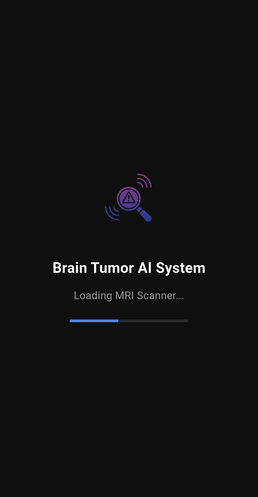
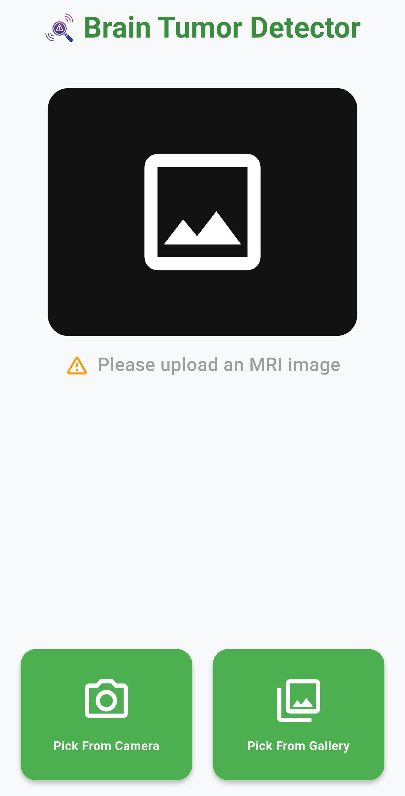
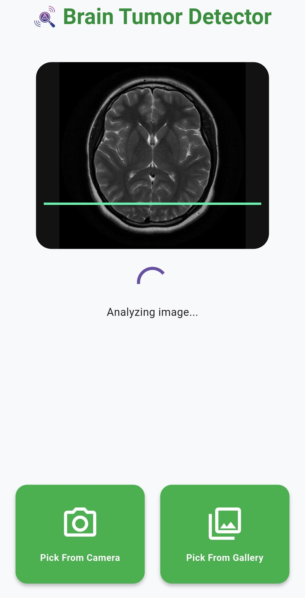
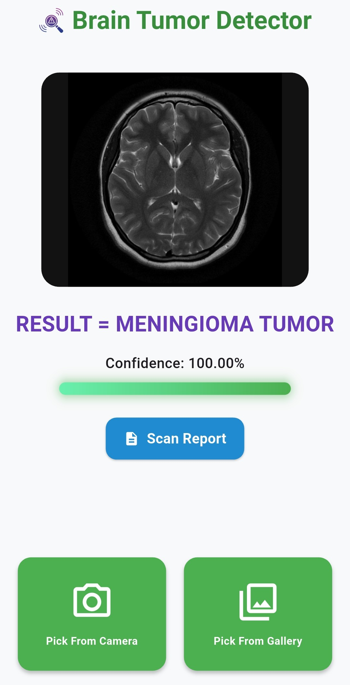
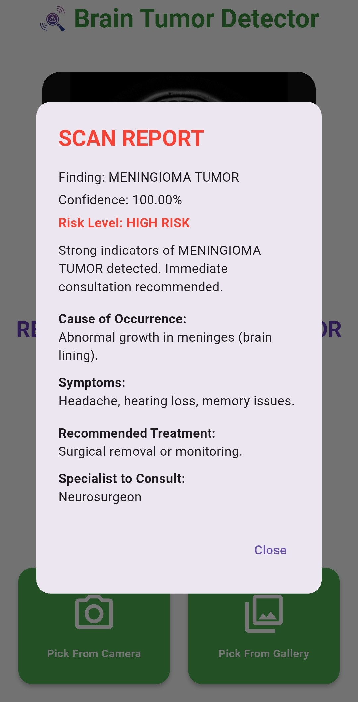

# 🧠 Brain Tumor Detection App

An AI-powered Flutter application that detects brain tumors from MRI scans using a TensorFlow Lite model.  
The app provides real-time predictions, confidence scores, and detailed diagnostic reports.

---

## 📲 Download App (Only for Android as of now)

[](https://github.com/Codeboy-710/brain-tumor-detector/releases/download/v1.0/app-release.apk)

---

## 🚀 Features

- 🧠 Brain tumor classification:
  - Glioma
  - Meningioma
  - Pituitary
  - No Tumor
  
- 📊 Confidence score visualization
- 📄 AI-generated scan report including:
  - Risk level
  - Symptoms
  - Causes
  - Treatment suggestions
  - Specialist recommendation
- 📷 Upload MRI via Camera / Gallery
- ⚡ Fast on-device inference (works offline)
- 🌙 Dark mode support
- 🎯 Clean and responsive UI

---

## 📸 Screenshots

<p align="center">
  
  
  
  
  
</p>

---

## 🧠 Tech Stack

- **Frontend:** Flutter (Dart)
- **ML Model:** TensorFlow Lite
- **Architecture:** 
     - Dense-Net based CNN
     - Efficient-Net
     - U-Net
     - Mobile-Net
- **Languages:** Dart, Python

---

## 🧠 ML Pipeline

- Image preprocessing (resizing, normalization)
- Model training using CNN architectures:
  - DenseNet (final deployed model)
  - EfficientNet
  - MobileNet
  - U-Net (segmentation experiments)
- Conversion to `.tflite` for mobile deployment

## 📁 ML Implementation Details

The complete machine learning pipeline, including model training, preprocessing, and experimentation with multiple architectures, is available in the [`ML codes/`](./ML codes) folder.

👉 Refer to the dedicated README inside the `ML codes/` directory for detailed information about:
- Model training process
- Dataset usage
- Architecture experiments
- Model export to TensorFlow Lite

---

## ⚙️ Setup (For Developers)

```bash
git clone https://github.com/YOUR_USERNAME/brain-tumor-detector.git
cd brain-tumor-detector
flutter pub get
flutter run
